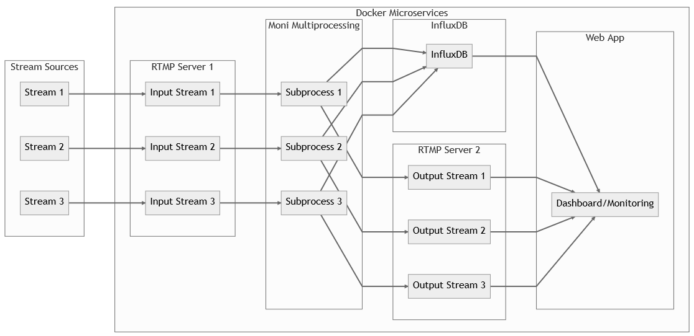

<br>

> This is the offical repository of our project `moni` for the hackathon [Hackathon Thurgau 2023](https://hackathon-thurgau.ch/). The project was created and developed during the hackathon competition.
>
> The project aims to provide a solution for the `Challenge 3: occupancy measurement of a store`. This was achieved by using a combination of computer vision and a cnn model (for ReID) to detect and track people in a store and their movement. The data is then used for further analysis and visualizations.

## Quicklinks

-   [Installation & Setup Guide](github-content/tech.md)
-   [Project Structure](#project-structure)
    -   [Folder Structure](#folder-structure)
    -   [Mermaid Diagram](#mermaid-diagram)
-   [Demo](#demo)

## Project Structure

### Folder Structure

```console
moni
├─── conf                               Configuration files
|    └─── example-config.yml            Example configuration file
├─── examples                           Configuration files
|    └─── homography.ipynb              Jupyter Notebook for homography show case
├─── github-content                     Images for the README.md
|    |─── tech.md                       Technical documentation how to use moni
|    └─── mermaid_chart.txt             Mermaid chart of the moni architecture
├─── Yolov7_StrongSORT_OSNet            Submodule from: mikel-brostrom
├─── .gitignore                         Gitignore file
├─── .gitmodules                        Gitmodules file
├─── Dockerfile                         Dockerfile to containerize moni
├─── README.md                          README.md
├─── main.py                            Moni main python script
├─── runner_utils.py                    Util functions which are used by moni
├─── runner.py                          Runner function which does the processing work
├─── requirements.txt                   Requirements file
└─── docker-compose.yml                 Docker compose file to spin up the whole moni platform

```

### Flow/Process Diagram



## Demo

This is a demo of the running application with 3 different views:


Video Source: [EPFL Labs](https://www.epfl.ch/labs/cvlab/data/data-pom-index-php/)
